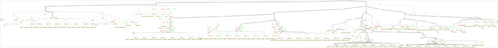
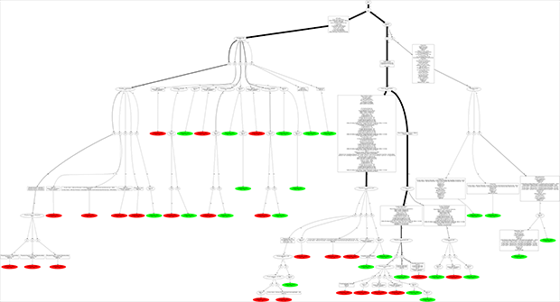

RefCountTracer
==============

A Utility to help track down memoryleaks caused by Reference Counting. 

But isn't reference counting a safe memory management technique? Mostly, but you are able to build circular references. E.g. Object1 references Object2 and Object2 references Object1. In this case the reference count is at least one and can never go to zero and free the objects. To make things worse the place where the circular reference is created can be far away from the place the object is created. 

The base idea of RefCountTracer is to visualize all places in your code where an interface reference is assigned. So you can check all that places for unintended circular references (and fix the problem e.g. turn them into weak references). Easy, isn't it? Just look a this diagram:

Easy! Ehhrrmmm, maybe not. This example diagram is in reality about 130000 x 12800 pixel large and contains several hundreds nodes. But nice that RefCountTracer can generate such thing out of a handful of stacktraces.

To the rescue: RefCountTracer can automatically eliminate most places where short living references are assigned. Only places where long living references were assigned are left - among them the leaking ones.

To make it clear: RefCountTracer is not able to pinpoint exactly the problematic part. But by looking at those diagrams one can more easily grasp what the code does and most boilerplate assignments are already eliminated.

Currently Delphi is the only supported language but it should be easy to extend it to other languages. As ARC is now the state of the art memory management technique most people don't know that Delphi had this build into the compiler since 1997 (Delphi 3). It came with Interfaces but now it gets more popular.

RefCountTracer consists of several parts:

1. Stack Trace-Logger (to be included in your source code)
2. Log-Processor (command line exe)
3. Graphviz (to generate fancy diagrams, not included, download here: http://graphviz.org/)

Requirements
============

1. Stack trace logger
---------------------
1. Delphi

  This utility isn't able to create the stack trace itself. It just logs it into a file. To create the stack trace currently MadExcept is needed. Other tools like JCLDebug or Eurekalog could be added later. As the logger is very simple it could work with older Delphi versions (but that's untested).

2. Other Languages

  The Stack trace logger can be very simple. The first version is far below 100 loc. It should be no problem to generate a log from other languages. The only thing needed is: Hacking into _AddRef & _Release and generating a stack trace (which may or may not be hard depending on the language)

2. Log-Processor
----------------
You can download the pre-built binary. To build it you need Delphi XE3 or XE4 (may also work with earlier versions).

3. Graphviz
-----------
[Graphviz](http://graphviz.org/) has to be downloaded and installed on your system.

How to
======

Just look into [Demo Project](Src/Demo/) to see how a stack trace log file is created (using [Tracer.Logger.pas](Src/Tracer.Logger.pas)). It's still rough but you should get the point.